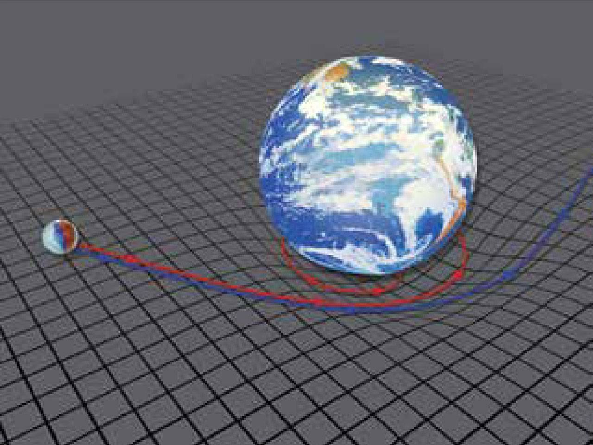

# 光是什么?

---

## 光是粒子
- 光的直线传播 (反射, 折射)
- 光电效应

---

## 光是电磁波
- 単缝衍射
- 双缝干涉
  

---

- 麦克斯韦方程-赫兹

> 电磁波的传播速度与波源无关, 只与传播介质有关

---

# 相对论

---

## 光的传播介质
Occam's Razor: Entities not be multiplied unneccessarily.  
奥卡姆剃刀原理: 如无必要, 勿增实体. 

>如果你发现了一个很奇怪的现象, 要对它进行解释就不得不做很多的假设, 可能不同的解释需要不同的假设, 根据奥克姆剃刀原理, 那个需要假设最少的解释往往是最接近真相的解释.

---

For coding:
如果你写一个功能, 写的很复杂, 自己都感觉写的很艰难, 那么一定存在一个简单实现方法~

---

## 光速不变
- 迈克尔逊-莫雷实验

> 地球以 30 km/s 绕太阳运动, 假设光传播有介质 "以太", 那么就会转动 90°就可以看到干涉条纹  

---

结论: "以太"介质不存在, 光速不变, 空间不具有各向异性

---

## 物理规律不变
> 在任何惯性系(匀速直线运动)中, 所有的物理规律都不变

---

# 推论

---

## 时间膨胀(钟慢效应)

---

---

---

(ct')² = (ct)² + (vt')²

c²t'² - v²t'² = c²t²

t'² = t² / ( 1 - v²/c² )

t' = t * 1/&radic;(1 - v²/c²)

洛伦兹因子 γ: 1/&radic;(1 - v²/c²)

t' = tγ

---

## 空间会收缩(尺缩效应)

l' = l/γ = l * &radic;(1 - v²/c²)

---

## 速度合成

w = ( u + v ) / (1 + uv/c²)

v1 = 0.9c, v2 = 0.9c

w = (0.9c + 0.9c) / ( 1 + 0.9c * 0.9c / c² ) = 0.9944c

---

## 质速神剑

m' = mγ = m / &radic;(1 - v²/c²)

E = 1/2 * mv²  (牛顿)

E = mc²

---

# 广义相对论

---

## 等效原理
- 加速度等效重力(引力)
- 空间站旋转

---

下图中, 电梯加速下降

---

---

---

推论: 引力使光线弯曲

---

## 时空弯曲

下图中, 圆盘匀速圆周运动, 从我们观察者来看:  
Tom 受到向心力, 但是他自己分不清是重力还是向心力  
Jerry 站在圆心, 相对我们静止的 

---

---

根据狭义相对论, Tom 的时间会变慢, 他的尺子会变短, 所测量的周长会偏小, Jerry 沿着半径测量的半径垂直于运动方向, 所以不会变, 那么转动圆盘的圆周率大于 2π

**`引力使时间和空间都弯曲了`**

---

## 引力是什么?
- 狭义相对论证明能量或信号的速度不能超过光速
- 引力引起光线弯曲, 光要走最短的路径, 在弯曲的空间里, 光的最短路径就是曲线
- 狭义相对论证明物理规律都是一样的, 那么地球上一个扔出去的小球也应该走的是最短路径, 如果没有引力, 小球就飞出去啦, 实际上小球走了一个抛物线, 那么这个就是小球认为在这个空间的最短路径, 这个空间又是被引力包裹的, 所以, 引力实际不是一种力, 只是空间弯曲的外在表现形式

---

地球是周围的空间弯曲, 一个小球小球速度如果速度足够大, 就会飞离, 速度不够, 就会沿着弯曲的面一直滚到底部;如果地球质量突然变小, 凹陷就浅一点, 会引起周围的空间曲度变化, 这个深度的变化会有一个过程, 形成一个波澜以光速传递出去, 这个波澜及空间波动就是引力波

---

## 实验证据

---

# 时空中的运动

---

---

---

>物体在空间中的运动速度会分走在时间中的运动速度，空间中运动得越快，在时间中就越慢。时间空间是一个密不可分的整体，任何物体都是在时空中做着相对运动，时间和空间是互相垂直的两个维度

---

## 时间旅行

> 平坦时间中上班一个小时后, 时间被弯曲后, 用了半个小时, 多弯曲一点, 10 分钟到, 再也不会迟到了~ 

---

## 神奇的四维

---

# 上帝不玩骰子?

---

## 波粒二象性
> 单个光子表现粒子性, 多个聚合表现出波动性
问题: 双缝干涉中, 单个光子通过了哪个缝?

---

---

光子不好观测, 所以用电子代替.

我们大可以在双缝上各安装一个用来观测和记录的仪器，来观察电子有没有通过这道狭缝。

实验表明: 一旦在狭缝上装了记录仪，他们确实可以观测到电子通过了某条狭缝；但怪异的是，一旦电子被观测到了，双缝干涉条纹也就消失了，如果不去观测，双缝条纹又会神奇地出现。

观测者和被观测者互相影响, 形成互补关系.

---

> 光子既不是通过了左缝, 也不是通过了右缝, 而是同事通过了左缝和右缝

至于为什么, 我也不知道啊

证明见: 贝尔不等式

---

# 宇宙四种"力"
- 万有引力
- 电磁力
- 强核力(质子中子结合)
- 弱核力(放射现象的原因)

---

# M 理论

--- 

## 超弦理论
> 基本粒子由弦组成, 弦的震动使粒子有了质量

---

---

## 十维空间
> 一个时间维, 三个展开的空间维度, 6 个蜷缩成弦的空间维度
